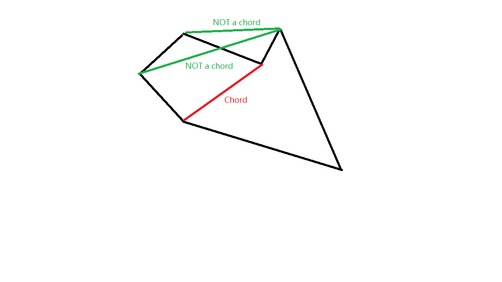

# Polygon Triangulization
## Chord:Segment that lies **completely inside** the polygon
 
* **Claim**:Every bounded polygon has at least 1 chord
* **Proof**
 * It is bounded and poly(n>3) so: for lowest vertex,assume left edge is a, right edge is b, we have a.minY()=b.minY()
 * Since it is bounded and has at least anotehr vertex, a.maxY() and b.maxY() **cannot be an edge**
 * If ab is not a chord -> ab should pass through an edge
 * Since the polygon has at least four vertices, the segment from a.maxY to b.maxY must not be an edge.  If a.maxY to b.maxY is not a chord, then it must cross another edge of the polygon.  An edge can't cross a chord twice, so one of its endpoints must be inside, which is another vertex of the polygon.

 *Take the vertex v that is farthest from a.maxY b.maxY.  The segment from a.minY to v must be a chord.  If another edge crossed it, one if its endpoints would be farther than v.   